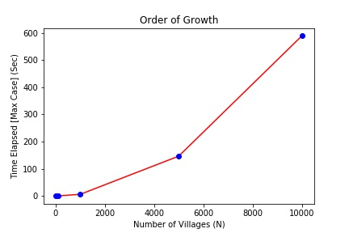
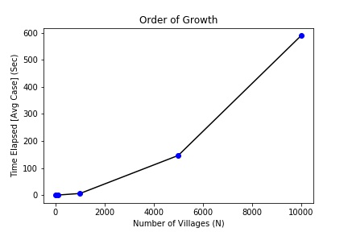
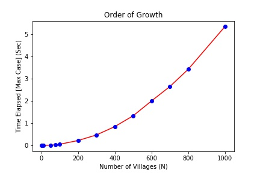
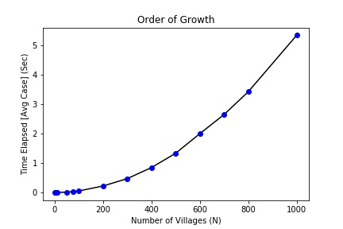
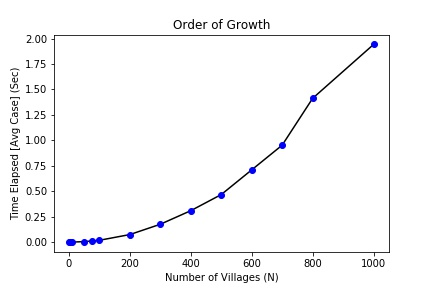
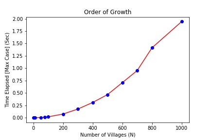

### Post-Office-Problem

We have n villages ${$V_0$,$V_1$,$V_2$,$V_3$, … ,$V_n-1$}$ which have two dimensional coordinates denoted by integer $x_i$
and $y_i$. A post office needs to be built in one of these villages. All villages are well connected with almost a
straight-line road.
* Using brute-force approach, design an algorithm to find the post-office location minimizing the average
distance between the villages and the post office.
* Using brute-force approach, design an algorithm to find the post-office location minimizing the
maximum distance from a village to the post office.
* Support your design by tricks to run those algorithms efficiently.
* Analyze your designed algorithms mathematically and empirically.
* Which minimization is more suitable for this application, average or maximum distance and why? And
which is faster to execute?

